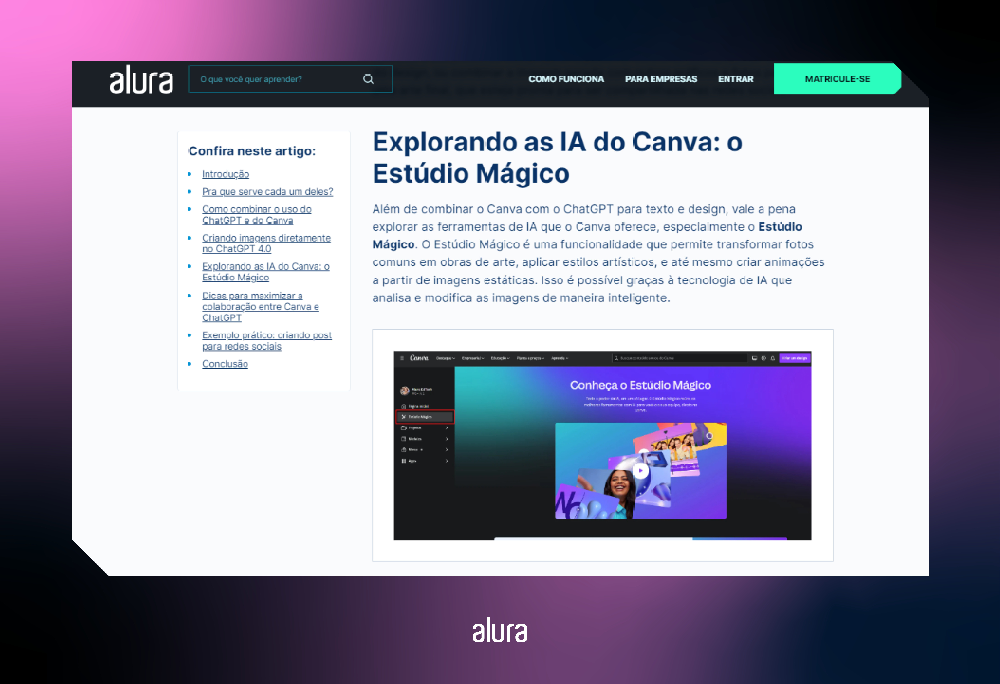

# Acessibilidade na web: principais conceitos


A importância da acessibilidade e de igualar as oportunidades para todas as pessoas não é uma novidade. Essa é a função das rampas, dos pisos táteis e das informações em braille.

De acordo com Organização Mundial de Saúde (OMS), existem 45,6 milhões de pessoas brasileiras com algum tipo de deficiência.

Isso equivale a quase 25% da população – 18,6% de pessoas com deficência visual, 7% com deficiência motora, 5,1% com deficiência auditiva e 1,4% com deficiência mental.

Nesse contexto, surge uma questão importante: _como fica o acesso à internet por todas as pessoas_?

É aí que entra a importância da **acessibilidade na web**, que traz a possibilidade de todas as pessoas poderem acessar a um site sem nenhuma dificuldade.

Afinal de contas, a internet é para todas as pessoas e o acesso à informação é um direito universal.

Diante da importância desse tema, o objetivo desse artigo é explicar o que é, qual é a importância da acessibilidade na web e, especialmente, como podemos garantir a aplicação de suas boas práticas em todos os sites.

## O que é acessibilidade na web?

**A acessibilidade na web se refere à prática de tornar os recursos e as informações disponíveis na internet acessíveis a todas as pessoas, independentemente de suas condições físicas ou cognitivas.**

O objetivo fundamental é garantir que todas as pessoas, incluindo as que tem deficiências visuais, auditivas, motoras ou cognitivas possam navegar, interagir e compreender todo o conteúdo online de maneira eficaz.

Para garantir que o conteúdo de acessibilidade evolua, o World Wide Web Consortium (W3C) – empresa também responsável pelo desenvolvimento e padronização da web – criou a [Web Content Accessibility Guidelines (WCAG)](https://www.w3.org/TR/WCAG21/), ou Diretrizes de Acessibilidade para Conteúdo Web, um conjunto de diretrizes internacionais de acessibilidade na web.

**Essas diretrizes têm a finalidade de orientar a criação de conteúdo web mais acessível e garantir que as informações online se tornem compreensível para todas as pessoas**.

No entanto, o guia é bastante extenso e já estamos na versõa 2.2 da WCAG. Por isso, esse é um guia com os dois tópicos fundamentais para entender antes de se aprofundar nas diretrizes: os princípios da acessibilidade da web e os seus critérios de sucesso.

## Princípios da acessibilidade web

A base para trabalhar com acessibilidade na web se divide em **quatro princípios diferentes, conhecidos como POUR**, que são a abordagem fundamental para garantir experiências inclusivas.

Pelas próprias palavras da WCAG, para que qualquer pessoa que queira usar a web, é necessário que o conteúdo siga esses princípios. Entenda melhor sobre cada um deles a seguir:

- **Perceptible (Perceptível)**: este princípio se concentra em tornar as informações e a interface do usuário perceptíveis para todas as pessoas. Isso inclui a disponibilidade de alternativas textuais, como descrições de texto para imagens, legendas ou transcrições para conteúdo de áudio e vídeo, e a capacidade de adaptar o conteúdo visual para atender às necessidades individuais, como aumento de tamanho de fonte.
  Um exemplo que ilustra esse princípio é o uso de textos alternativos para elementos que não possuem mensagens textuais, como imagens, ícones e ilustrações.

Este princípio visa garantir que as informações e componentes da interface do usuário sejam apresentados de maneira que todas as pessoas possam percebê-los, inclusive aqueles que utilizam tecnologias assistivas, como leitores de tela.

Essas mensagens são principalmente usadas para pessoas que necessitam utilizar softwares de leitura de tela para conseguir navegar em sites.

Aqui na Alura, estamos constantemente usando textos alternativos para melhorar o entendimento para todas as pessoas.

Um exemplo recente disso foi no artigo Canva e ChatGPT: mais produtividade no design, em que na segunda imagem foi elaborada uma descrição e incluída dentro do atributo alt, no próprio arquivo HTML.



```

```

- **Operable (Operável)**: a operabilidade refere-se à interação eficaz dos usuários com o conteúdo e a navegação. Isso envolve facilitar a navegação usando diferentes dispositivos de entrada, como teclado ou assistentes de voz, para garantir que as pessoas tenham tempo suficiente para ler e interagir com o conteúdo.
  Isso evita que os elementos causem confusões e fornece métodos claros e consistentes de navegação e interação.

Para esse exemplo, trago a página de buscas do Google, que trabalha muito bem com a navegação por teclados. Sem sequer encostar no mouse, o site permite muito bem utilizar a tecla tab para avançar e a combinação de shift e tab para retornar nos links e campos, no mesmo sentido da leitura e mantendo a hierarquia do conteúdo.


Note que ao navegar pelo teclado, um retângulo sempre estará destacando o local selecionado. Ter essa sinalização é importante pois facilita o entendimento do que está sendo selecionado, para que a pessoa saiba que ao clicar na tecla enter ou na barra de espaço, será enviado para o link em questão.

- **Understandable (Compreensível)**: este princípio visa garantir que as informações e a operação da interface do usuário sejam compreensíveis para todos os usuários.
  Isso inclui a legibilidade e compreensibilidade do texto, evitando jargões ou linguagem complexa, mantendo consistência na apresentação e na navegação, e fornecendo instruções claras e previsíveis durante a interação.

Particularmente, gosto de resumir esse princípio com a frase “não deixe a pessoa usuária ficar pensando”. As informações precisam ser claras e as atividades, principalmente as mais comuns, não devem ser complexas de interagir.

Um exemplo corriqueiro disso está presente em campos de data, como data de nascimento ou validade do cartão de crédito.

É comum encontrar um placeholder ou alguma dica indicando que o formato deve ser “DD/MM/AAAA”, que é o formato padrão de data no Brasil. O uso das letras iniciais de cada palavra, junto com a quantidade de vezes, facilita entender como o campo precisa ser preenchido e evita erros.

- **Robust (Robusto)**: a robustez assegura que todas as pessoas interpretem o conteúdo de maneira confiável por uma variedade de tecnologias e agentes de pessoas usuárias.
  Isso envolve seguir padrões e práticas de codificação que garantam a compatibilidade com diferentes navegadores, dispositivos e softwares de apoio.

Nesse princípio, da mesma forma como em “perceptível”, o HTML está altamente presente. De forma geral, a linguagem HTML é extremamente simples de se aprender e utilizar.

Ela pode até parecer ser somente a estrutura para carregar estilos, animações e códigos avançados, mas essa é a linguagem que muitas vezes permite um site ser verdadeiramente acessível.

Considere uma página web que inclui um formulário de contato. Ao projetar esse formulário, é fundamental utilizar uma marcação HTML robusta e semântica para garantir que ele seja interpretado corretamente por diferentes tecnologias assistivas.

Veja um exemplo de um código HTML bem elaborado para um formulário:

```
<form action="/enviar" method="post">
  <label for="nome">Nome:</label>
  <input type="text" id="nome" name="nome" required>

  <label for="email">E-mail:</label>
  <input type="email" id="email" name="email" required>

  <label for="mensagem">Mensagem:</label>
  <textarea id="mensagem" name="mensagem" rows="4" required></textarea>

  <button type="submit">Enviar</button>
</form>
```

Note que as tags `<label>` estão associadas corretamente aos campos de entrada usando o atributo for, fornecendo uma relação clara entre o rótulo e o campo.

Já o campo de e-mail, para identificar corretamente a informação que deve ser digitada, está usando o type="email", que permite aos navegadores e tecnologias assistivas fornecerem validação específica para endereços de e-mail.

É normal também que em formulários hajam campos obrigatórios, logo o atributo required é utilizado para essa indicação, garantindo que o usuário preencha os campos para enviar o formulário.

Ao adotar e implementar esses princípios, as diretrizes da WCAG buscam criar uma web mais inclusiva, promovendo a igualdade de acesso a informações e serviços online.

Essa abordagem não apenas beneficia pessoas com deficiência, mas também proporciona uma experiência mais eficaz e amigável para todas as pessoas.

A WCAG continua a evoluir para acompanhar as mudanças tecnológicas e as melhores práticas de acessibilidade, destacando a importância contínua de se comprometer com a criação de conteúdo online acessível.

Se você quiser ler mais sobre esse conteúdo direto da fonte, leia o tópico Understanding the Four [Principles of Accessibility](https://www.w3.org/WAI/WCAG21/Understanding/intro#understanding-the-four-principles-of-accessibility).

## Critérios de sucesso

Ao longo de toda a documentação da WCAG, existem uma série de diretrizes para cenários diferentes.

O formato que eles trazem para indicar o critério de sucesso de uma diretriz não é determinar se algo está certo ou errado, mas sim com níveis estabelecidos.

Esses níveis permitem que a equipe de design e tecnologia testem, validem, e atendam as necessidades de diferentes grupos e situações.

Os níveis de conformidade são definidos como A, AA e AAA.

### Nível A (mínimo de conformidade)

Este nível estabelece critérios básicos que são considerados essenciais para tornar o conteúdo minimamente acessível.

Inclui requisitos como a disponibilidade de texto alternativo para imagens, a possibilidade de navegação do conteúdo apenas com o teclado, a adaptação para diferentes tamanhos de texto e contraste suficiente entre texto e fundo.

### Nível AA

O nível AA, além de atender as conformidades do nível anterior, também aborda aspectos mais avançados da acessibilidade.

Trata de cores com contrastes acessíveis, legendas para conteúdo de áudio e vídeo, formulários mais acessíveis, além de garantir uma navegação consistente e compreensível.

### Nível AAA (maior nível de conformidade)

Esse é o nível mais rigoroso e abrange uma gama ainda mais ampla de critérios de sucesso. Inclui requisitos como legendas ao vivo para transmissões ao vivo, permitir que os usuários personalizem a apresentação do conteúdo, garantir uma navegação mais flexível e fornecer uma experiência mais robusta para tecnologias assistivas.

É importante observar que alcançar o Nível AAA pode ser desafiador e, em alguns casos, pode não ser prático ou viável para todos os tipos de conteúdo ou aplicações. Portanto, muitas organizações e desenvolvedores optam por atender pelo menos ao Nível AA para equilibrar a acessibilidade com a viabilidade prática.

Se você quiser ler mais sobre esse conteúdo pela própria WCAG, leia os tópicos [Conformance Level](https://www.w3.org/TR/WCAG21/#cc1) e [Understanding Levels of Conformance](https://www.w3.org/WAI/WCAG21/Understanding/conformance#levels).

### Conclusão

A verdade é que não basta ler informações para aprender todos os conteúdos de acessibilidade.

Antes de colocar isso em prática nos sites que você for atuar, entenda como isso funciona em outros produtos e, na dúvida, sempre se baseie em plataformas de algumas big techs, como Google, Meta e Apple, que por terem uma gama alta de pessoas usuárias, tratam bem a acessibilidade nos seus serviços.

Uma recomendação que faço é instalar no seu computador algum software de leitura de tela, para ter uma imersão em como é navegar na internet sem olhar para um monitor, e muito menos mexer em um mouse.

Não tenho dúvidas de que seu nível de empatia vai subir numa escala imensurável. Deixo de recomendação o [NVDA](https://www.nvaccess.org/download/).

- ### [Artigo de Mateus Villain para a ALURA](https://www.alura.com.br/artigos/acessibilidade-na-web)

### [Voltar ao Menu - Acessibilidade e tecnologias web](./menu.md)
